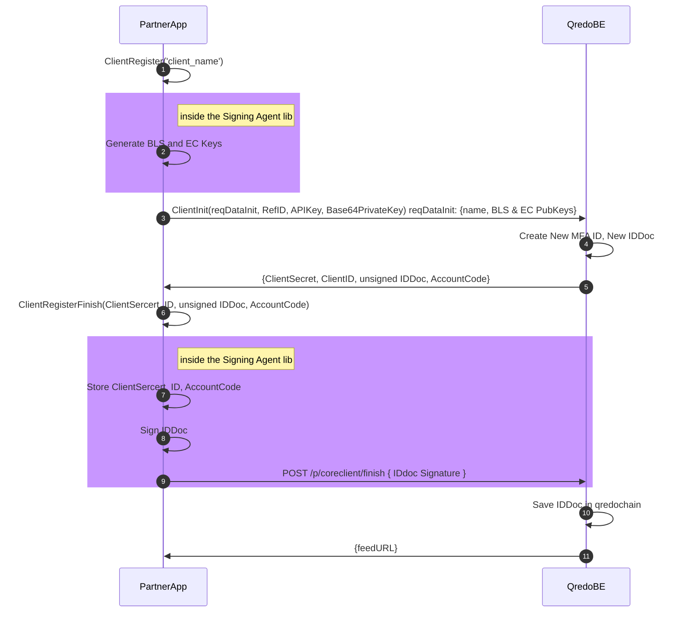
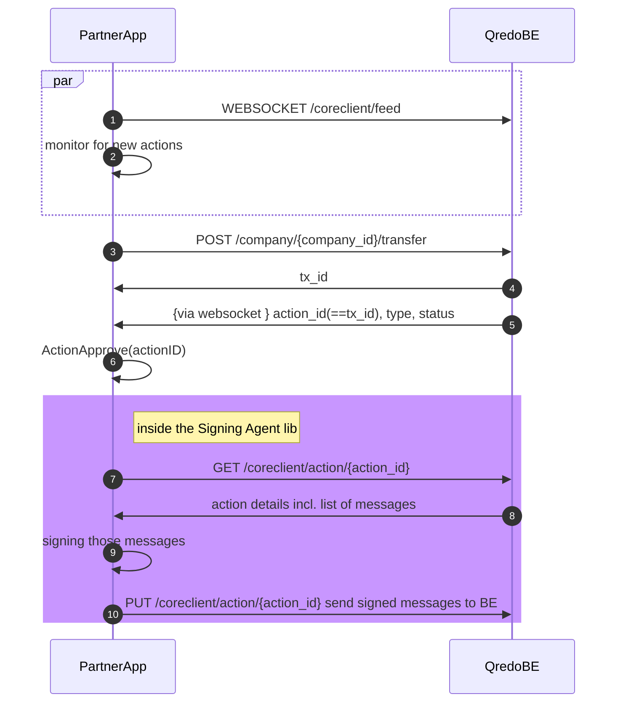

# Build

## Dependencies

> To use Signing Agent, we recommend building the Docker image. However, should you wish to develop or extend this tool, you can self-build.

To build the Signing Agent, you will use:

- ***AMCL - Apache Milagro Crypto Library***

> Please refer to the
[apache/incubator-milagro-crypto-c](https://github.com/apache/incubator-milagro-crypto-c) repository for installation instructions.

- Golang environment

## How to build

### Building the executable

> Tested on UNIX systems. Windows is untested as a deployment environment, but there's nothing inherently non-portable.

The Signing Agent service is written in Go, using version go1.18+. It is a single executable. That executable binary can be built by running the following in the project root folder:

```bash
    make build
```

This creates the executable: ***./out/signing-agent***

### Building the signing-agent docker container
```shell
> ./build.sh docker_latest
```
This creates the signing-agent docker image: ***signing-agent:latest***
## Running Tests
```shell
> make test
```
will run all unit and restAPI tests.

```shell
> make unittest
```
runs just unit test.
```shell
> make apitest
```
will run the restAPI test.

### End-to-end test (e2e)
In order to run the e2e test, the APIKEY and BASE64PKEY (the base64 of the private.pem file) for a Qredo account to test against are needed. Ensure both the APIKEY and BASE64PKEY are set in the environment before running the e2e test.
The following are required for the e2e test:

| Variable     | Description                                       |
|-------------|----------------------------------------------------|
| APIKEY      | The API key for the Qredo account to test against  |
| BASE64PKEY  | The Base64-encoded RSA private key for the account |

These should be set before the running the e2e test. And then:
```shell
> make e2etest
```
to run the e2e test.

## Use Signing Agent as a Library

It may be beneficial to couple the Signing Agent with an application or a service. In this case, it can be imported 
as a Go package directly into that application.

An example of the Signing Agent onboarding process using the Signing Agent library in a Go App would look like:



## Approve a transaction

Prerequisites:

- a Signing Agent service instance has been installed and configured
- a signing-agent has been created with id `agentID`

Steps:

1. A websocket connection to the *Qredo BE* is opened for said `agentID`
2. *PartnerApp* is constantly monitoring for new actions to be handled
3. A new transfer is initiated
4. The *Qredo BE* returns the transaction id: `tx_id`
5. Shortly after, a new action is received through the websocket with `action_id` equal to the `tx_id` for the transfer.
6. Initiate new action
7. The *PartnerApp* requests from the *Qredo BE* details for the action
8. *Qredo BE* returns action details incl. the payload (list of messages)
9. Sign payload (for the new action)
10. The *PartnerApp* decides to approve the transactions, thus sending the payload to the Signing Agent with a:

- `PUT` request for approve
- `DELETE` for reject

After that sequence, the transaction flow is complete.

## Use the library to approve a transaction


## Data Models

```Go
ClientRegisterFinishRequest {
    accountCode    string
    clientID   string
    clientSecret   string
    id  string
    idDoc  string
}
```

```Go
ClientRegisterRequest {
    name             string
    apikey           string
    base64privatekey string
}
```

```Go
SignRequest {
    message_hash_hex    string
}
```

```Go
VerifyRequest {
    message_hash_hex    string
    signature_hex   string
    signer_id   string
}
```

```Go
clientRegisterFinishResponse {
    feed_url    string
}
```

```Go
clientRegisterResponse {
    bls_public_key  string
    ec_public_key   string
    ref_id  string
}
```

```Go
signResponse {
    signature_hex   string
    signer_id   string
}
```
